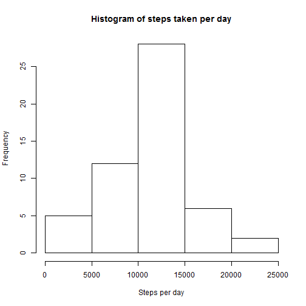
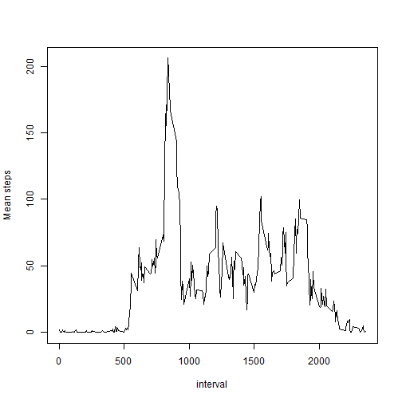
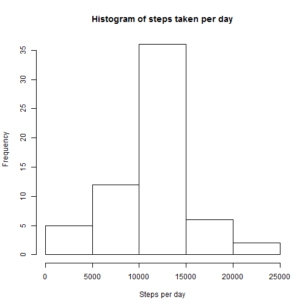
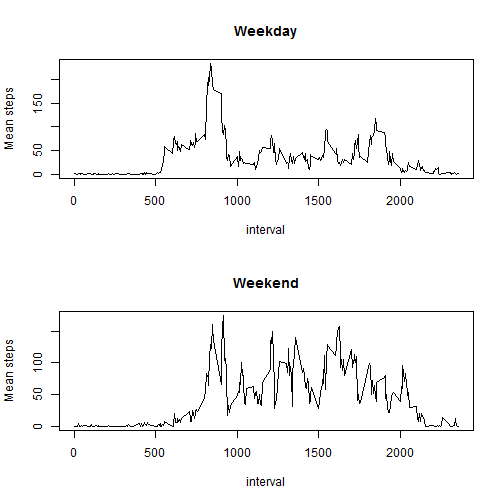

## Loading and preprocessing the data

```r
unzip("activity.zip")
activity <- read.csv("activity.csv")
```

## What is mean total number of steps taken per day?

Using **group_by** and **summarise** from dplyr package to calculate total steps for each day
and then make a histogram

```r
library("dplyr")
group_day <- group_by(activity,date)
step_day <- summarise(group_day,sum_step = sum(steps))
hist(step_day$sum_step, xlab="Steps per day", main = "Histogram of steps taken per day")
```

 

Calculate the mean and median of the numbers of steps


```r
mean(step_day$sum_step, na.rm = TRUE)
```

```
## [1] 10766.19
```

```r
median(step_day$sum_step, na.rm = TRUE)
```

```
## [1] 10765
```

## What is the average daily activity pattern?

Group the data set by interval and calculate the average number of steps for each interval
then create a line plot

```r
library("dplyr")
group_interval <- group_by(activity, interval)
mean_step_interval <- summarise(group_interval, mean_interval = mean(steps, na.rm=TRUE))
with(mean_step_interval,plot(interval,mean_interval,type="l",ylab = "Mean steps"))
```

 

Find the interval with the maximum number of steps

```r
with(mean_step_interval,interval[which.max(mean_interval)])
```

```
## [1] 835
```

## Imputing missing values

Find the number of missing rows

```r
sum(!complete.cases(activity))
```

```
## [1] 2304
```

Fill in the missing values using the mean steps for the same interval.
For each row, first check if steps is NA then replace it with the mean_interval in the mean_step_interval data frame defined previously.

```r
activity_fillna = activity
for (i in 1:nrow(activity_fillna)){
  if (is.na(activity_fillna$steps[i])){ 
    activity_fillna$steps[i] = with(mean_step_interval,mean_interval[interval== activity_fillna$interval[i]])
  }
}
```

Using the data frame with filled in data for analysis

```r
group_day_fillna <- group_by(activity_fillna,date)
step_day_fillna <- summarise(group_day_fillna,sum_step = sum(steps))
hist(step_day_fillna$sum_step, xlab="Steps per day", main = "Histogram of steps taken per day")
```

 

```r
mean(step_day_fillna$sum_step, na.rm = TRUE)
```

```
## [1] 10766.19
```

```r
median(step_day_fillna$sum_step, na.rm = TRUE)
```

```
## [1] 10766.19
```

## Are there differences in activity patterns between weekdays and weekends?

Add a variable dayOfWeek to indicate if the day is weekday or weekend

```r
activity$dayOfWeek <- weekdays(as.Date(activity$date))
activity$dayOfWeek = factor(activity$dayOfWeek=="Saturday"|activity$dayOfWeek=="Sunday",levels = c(TRUE,FALSE),labels=c("Weekend","Weekday"))
```

Create a data frame to calculate the average steps for **interval** and for **dayOfWeek**
and subset the data for weekday and weekend.
Finally, create a two panel plot

```r
group_dayOfWeek <- group_by(activity, interval, dayOfWeek)
mean_step_dayOfWeek <- summarise(group_dayOfWeek, mean_interval = mean(steps, na.rm=TRUE))
mean_step_weekday <- subset(mean_step_dayOfWeek, dayOfWeek =="Weekday")
mean_step_weekend <- subset(mean_step_dayOfWeek, dayOfWeek =="Weekend")

par(mfrow=c(2,1))
with(mean_step_weekday,plot(interval,mean_interval,type="l",main="Weekday",ylab = "Mean steps"))
with(mean_step_weekend,plot(interval,mean_interval,type="l",main="Weekend",ylab = "Mean steps"))
```

 

